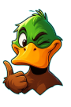

# PatoMania 🦆

**PatoMania** é um jogo interativo de tiro ao pato construído como uma **Single Page Application (SPA)**, utilizando HTML5, CSS3 e JavaScript puro. O projeto foi desenhado com uma arquitetura modular e uma navegação inteligente para proporcionar uma experiência de usuário fluida e sem recarregamentos de página.



## ✨ Funcionalidades Principais

- **Arquitetura Single Page Application (SPA)**: O conteúdo do jogo (tutorial, menu, etc.) é carregado dinamicamente sem a necessidade de atualizar a página, graças a um roteador central em JavaScript.
- **Fluxo de Navegação Inteligente**: O jogo verifica se o tutorial já foi concluído. Novos jogadores são direcionados para o tutorial, enquanto jogadores recorrentes vão direto para o menu principal.
- **Tutorial Interativo**: Uma introdução completa ao jogo com uma cutscene animada e um guia passo a passo das mecânicas.
- **Componentes Modulares**: Cada "página" (Splash, Tutorial, Menu, Jogo) possui seus próprios arquivos HTML, CSS e JS, mantendo o código organizado e desacoplado.
- **Comunicação por Eventos**: A navegação entre os componentes é gerenciada por eventos customizados (`tutorialFinished`, `playGame`), evitando dependências diretas e promovendo um código mais limpo.
- **Design Responsivo e Moderno**: Interfaces desenhadas com foco em dispositivos móveis, ricas em animações CSS.
- **Modo Tela Cheia**: Um botão de utilidade para imersão total no jogo.

## 🛠️ Tecnologias Utilizadas

- **HTML5**: Estrutura semântica para todo o conteúdo.
- **CSS3**: Estilização avançada com Flexbox, Grid, animações (`@keyframes`) e design responsivo.
- **JavaScript (ES6+)**: Lógica do jogo, manipulação do DOM, arquitetura SPA e gerenciamento de eventos.

## 📂 Estrutura do Projeto

A estrutura de arquivos foi organizada para refletir a arquitetura modular da aplicação:

```
PatoMania/
├── assets/              # Recursos visuais (imagens, sprites, etc.)
│   ├── duck/
│   ├── logo/
│   ├── protagonist/
│   ├── stage/
│   └── tools/
├── scripts/
│   ├── game.js          # Lógica da página do jogo
│   ├── menu.js          # Lógica da página de menu
│   ├── splash.js        # Lógica da página de splash
│   └── tutorial.js      # Lógica do tutorial interativo
├── source/
│   ├── game.html        # Conteúdo HTML do jogo
│   ├── menu.html        # Conteúdo HTML do menu
│   ├── splash.html      # Conteúdo HTML da splash
│   └── tutorial.html    # Conteúdo HTML do tutorial
├── styles/
│   ├── game.css         # Estilos do jogo
│   ├── menu.css         # Estilos do menu
│   ├── splash.css       # Estilos da splash
│   └── tutorial.css     # Estilos do tutorial
├── .git/                # Metadados do Git
├── index.html           # Ponto de entrada da SPA (casca principal)
├── script.js            # Orquestrador principal da SPA (roteador)
├── style.css            # Estilos globais
└── README.md            # Este arquivo
```

## 🚀 Como Executar

Para executar o projeto, é recomendado o uso de um servidor local para evitar problemas de CORS com as requisições `fetch` dos arquivos HTML.

1.  **Clone o repositório:**
    ```bash
    git clone https://github.com/iSamuel-Z/PatoMania.git
    ```

2.  **Navegue até a pasta do projeto:**
    ```bash
    cd PatoMania
    ```

3.  **Inicie um servidor local:**
    Se você tiver o **Visual Studio Code** com a extensão **Live Server**, basta clicar em `Go Live` no canto inferior direito.

    Alternativamente, você pode usar o Python para iniciar um servidor simples:
    ```bash
    # Python 3
    python -m http.server
    ```

4.  Abra o navegador e acesse `http://localhost:8000` (ou o endereço fornecido pelo Live Server).

## 📝 Licença

Este projeto está sob a licença MIT. Veja o arquivo `LICENSE` para mais detalhes.
