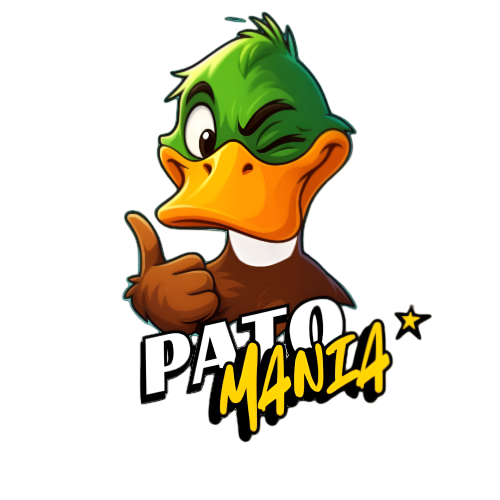

# PatoMania 🦆

Jogo interativo de patos desenvolvido com HTML5, CSS3 e JavaScript puro.



## ✨ Funcionalidades
- **Tela inicial animada**: Efeitos CSS em patos flutuantes
- **Sistema de carregamento**: Barra de progresso com animação
- **Menu principal**: Interface intuitiva com botão Play
- **Design responsivo**: Adapta-se a diferentes dispositivos

## 🛠 Tecnologias
- **Frontend**: 
  - HTML5 semântico
  - CSS3 (Flexbox, Grid, Animations)
  - JavaScript (DOM Manipulation)

## 🚀 Como executar
```bash
git clone https://github.com/iSamuel-Z/PatoMania.git
cd PatoMania
start index.html
```

## 📂 Estrutura
```
PatoMania/
├── assets/          # Imagens e recursos
│   ├── duck/        # Sprites de patos
│   ├── logo/        # Logotipos
│   └── stage/       # Cenários do jogo
├── source/          # Códigos adicionais
│   └── styles/      # Folhas de estilo
├── index.html       # Página inicial
├── style.css        # Estilos principais
└── script.js        # Lógica do jogo
```

## 📝 Licença
MIT License - código aberto para aprendizado
